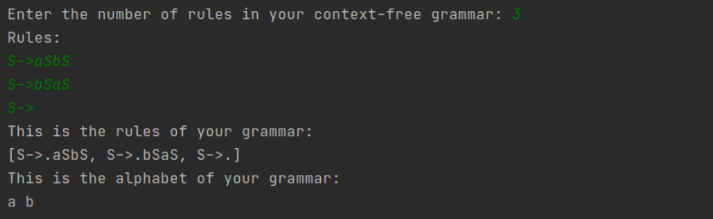
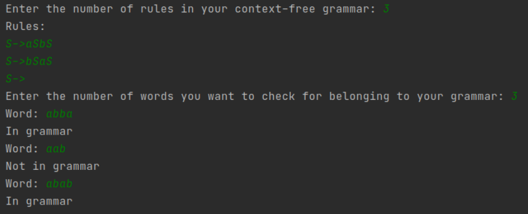

# Practical task on Earley and LR(1) parsers
 

### Задание:
Реализовать алгоритмы Эрли и LR(1), которые проверяют, выводится ли слово в заданной контекстно-свободной грамматике.


#### Взаимодействие с парсерами:
Контекстно-свободный язык задается правилами, которые вводятся в виде
`A->BCa+D`, где заглавные буквы это нетерминалы, а все остальные символы
терминалы (алфавит грамматики). Отметим, что в левой части правила может стоять
только один символ - нетерминал. Более того, запрещается использовать `$`
и `#` ни в левой, ни в правой части правил, так как эти символы 
являются вспомогательными в реализации парсеров. Если в грамматике есть 
правило `S->epsilon`, то задать его можно как выводимость пробела, то есть
`S->"пробел"`. 

##### Важно:
Парсер Эрли, принимает любую контекстно-свободную грамматику. Тем временем,
парсеру LR(1) на вход может подаваться только та 
контекстно-свободная грамматика, что не содержит 
эпсилон-порождающие нетерминалы. 

#### Примеры взаимодействия:

Запуск ```./ContextFreeGrammar-bin```


Запуск ```./Earley-bin```


#### Для сборки проекта:

- Выполните установку пакетов boost:
    - Ubuntu: ```sudo apt-get install libboost-all-dev```
    - MacOS: ```brew install boost```

- Выполните установку openssl:
    - Ubuntu: ```sudo apt-get install openssl libssl-dev```
    - MacOS: ```brew install openssl@1.1```

- Создайте папку build, перейдите в нее

- Выполните ```cmake -DCMAKE_BUILD_TYPE=Debug ..```

- После этого найдите версию интерпретатора python в выводе, выполните:
  ```./install_deps.sh python<your python version> (3.6, 3.8, …)```

- Далее запустите сборку проекта: ```make -j<num cores + 1>```

- В папке bin появятся исполняемые файлы, библиотека .so и файлы для прогона тестов

- Для запуска покрытия тестами выполните: ```make coverage_report```

- В папке build появится html-файл с покрытием кода тестами


*Задание выполнила Чубенко Полина, Б05-022*